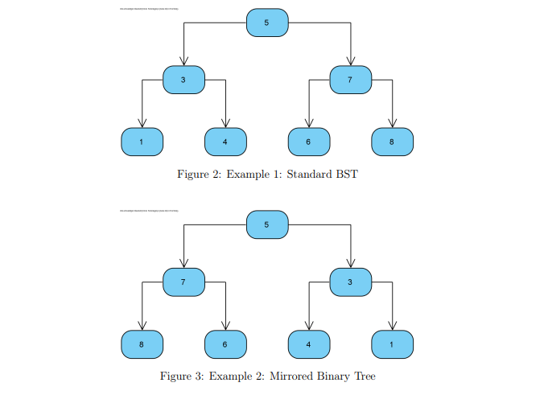
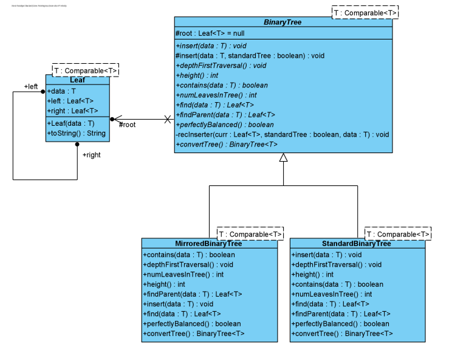

# Binary Search Tree in Java

## Description

This project implements both Standard and Mirrored Binary Search Trees in Java.

- The Standard Binary Search Tree is a node-based binary tree data structure with the following properties:
  - The left subtree of a node contains only nodes with keys lesser than the node's key.
  - The right subtree of a node contains only nodes with keys greater than the node's key.
  - The left and right subtree each must also be a binary search tree.

- The Mirrored Binary Search Tree is the opposite of the Standard Tree.

### Example Trees



### Data Structure
- Binary Search Tree

### Methods
- Recursive Traversal
- Standard Traversal

## UML Diagrams And Functions



## Requirements before running codes:

- Install an IDE that compiles and runs Java codes. Recommendation: VS Code
- How to setup WSL Ubuntu terminal shell and run it from Visual Studio Code:
  [YouTube Tutorial](https://www.youtube.com/watch?v=fp45HpZuhS8&t=112s)
- How to Install Java JDK 17 on Windows 11: [YouTube Tutorial](https://www.youtube.com/watch?v=ykAhL1IoQUM&t=136s)

### Installing Oracle JDK on Windows subsystem for Linux:

1. **Run WSL as Administrator**
2. **Installing Oracle JDK on Windows Subsystem for Linux (WSL)**  
   If you're working in a WSL environment, follow these steps to install Oracle JDK:

   - Run the WSL terminal as **Administrator**.
   - Set necessary permissions and variables:
   
     ```bash
     set -ex
     export JDK_URL=http://download.oracle.com/otn-pub/java/jdk/8u131-b11/d54c1d3a095b4ff2b6607d096fa80163/jdk-8u131-linux-x64.tar.gz
     export UNLIMITED_STRENGTH_URL=http://download.oracle.com/otn-pub/java/jce/8/jce_policy-8.zip
     ```

   - Download the JDK and unzip the archive:

     ```bash
     wget --no-cookies --header "Cookie: oraclelicense=accept-securebackup-cookie" ${JDK_URL}
     tar -xzvf jdk-*.tar.gz
     rm -fr jdk-*.tar.gz
     ```

   - Move the JDK to the correct directory and configure it:

     ```bash
     sudo mkdir -p /usr/lib/jvm
     sudo mv jdk1.8* /usr/lib/jvm/oracle_jdk8
     wget --no-cookies --header "Cookie: oraclelicense=accept-securebackup-cookie" ${UNLIMITED_STRENGTH_URL}
     unzip jce_policy-8.zip
     mv UnlimitedJCEPolicyJDK8/local_policy.jar /usr/lib/jvm/oracle_jdk8/jre/lib/security/
     mv UnlimitedJCEPolicyJDK8/US_export_policy.jar /usr/lib/jvm/oracle_jdk8/jre/lib/security/
     ```

   - Configure alternatives for Java and Javac:

     ```bash
     sudo update-alternatives --install /usr/bin/java java /usr/lib/jvm/oracle_jdk8/jre/bin/java 2000
     sudo update-alternatives --install /usr/bin/javac javac /usr/lib/jvm/oracle_jdk8/bin/javac 2000
     ```

   - Set environment variables:

     ```bash
     sudo echo "export J2SDKDIR=/usr/lib/jvm/oracle_jdk8
     export J2REDIR=/usr/lib/jvm/oracle_jdk8/jre
     export PATH=$PATH:/usr/lib/jvm/oracle_jdk8/bin:/usr/lib/jvm/oracle_jdk8/db/bin:/usr/lib/jvm/oracle_jdk8/jre/bin
     export JAVA_HOME=/usr/lib/jvm/oracle_jdk8
     export DERBY_HOME=/usr/lib/jvm/oracle_jdk8/db" | sudo tee -a /etc/profile.d/oraclejdk.sh
     ```

   > **Note**: You can update the links for other JDK versions if needed.

## Makefile

A Makefile is included to compile and run the codes on the terminal with the following commands:

- `make clean`
- `make`
- `make run`

Here's the content of the Makefile:

```makefile
default:
	javac *.java

run:
	java App

clean:
	rm -f *.class
	reset
	clear

tar:
	rm -f *.class *.tar.gz
	tar -cvz BST.java makefile -f uBST.tar.gz

unzip:
	tar -zxvf *.tar
```

## How to Run

1. Ensure you have Java JDK installed on your system.
2. Clone or download this repository to your local machine.
3. Open a terminal and navigate to the project directory.
4. Run the following commands in order:
   ```
   make clean
   make
   make run
   ```

## Contributing

This project is primarily for educational purposes. However, if you have suggestions for improvements, feel free to open an issue or submit a pull request.

## License

This project is open source. Please check the repository for any specific license information.
